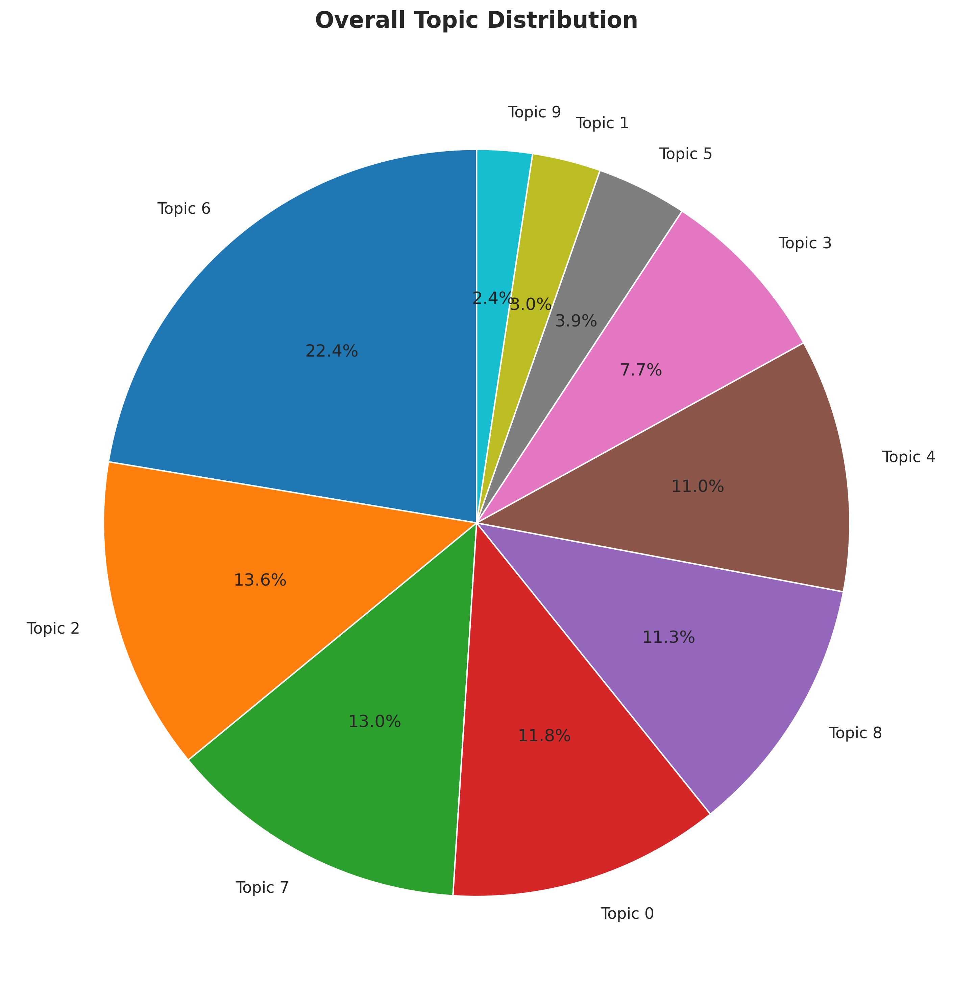
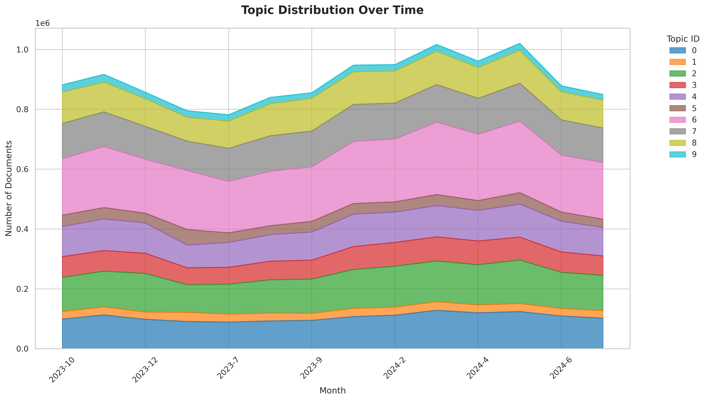

# Natural Language Processing (NLP) Findings

## Introduction

This study employs Natural Language Processing (NLP) techniques to investigate discussions related to Technology, Science, and Artificial Intelligence on Reddit. We analyze community discourse across multiple subreddits to identify dominant topics, track sentiment trends over time, and explore thematic differences in ethical, technical, and societal discussions. Methods include Latent Dirichlet Allocation (LDA) for topic modeling, VADER for sentiment analysis, and rule-based text classification to generate word clouds, providing both quantitative and visual insights into the semantic structure and community focus within AI- and technology-related discussions.

## Research Question 5: What are the dominant topics within Technology/Science/AI-related subreddits?

As shown in the figure, the Latent Dirichlet Allocation (LDA) model identifies ten distinct topics from the corpus, each represented by its most influential keywords. These keywords provide an interpretable summary of the semantic focus of each discovered topic.

**Topic 0** is characterized by keywords such as *data*, *apple*, *ai*, *science*, *user*, and *marketing*, suggesting that this topic centers on discussions related to data science, artificial intelligence, and technology-driven business practices.

**Topic 1** includes terms such as *karma*, *comment*, *subreddit*, *message*, and *questions*, indicating that it reflects conversations about community interactions, platform moderation, and posting behaviors within online forums such as Reddit.

**Topic 2** is defined by words like *human*, *ai*, *power*, *energy*, *car*, and *years*, representing discourse around human–AI relations, emerging technologies, and long-term trends in energy and transportation.

**Topic 3** contains keywords including *word*, *images*, *water*, *read*, and *data*, pointing to content associated with information extraction, text and image processing, and data-driven analysis.

**Topic 4** focuses on terms such as *code*, *python*, *data*, *using*, *language*, and *windows*, clearly corresponding to programming-related discussions involving software tools, coding practices, and computational workflows.

**Topic 5** includes *reddit*, *app*, *api*, *change*, *party*, *commercial*, and *pricing*, which collectively suggest themes related to application development, API usage, and commercial product or platform changes.

**Topic 6** is composed of more conversational keywords such as *something*, *never*, *someone*, *bad*, *lol*, and *yeah*, indicating informal, colloquial exchanges or personal expressions within the corpus.

**Topic 7** features terms like *learn*, *help*, *project*, *learning*, *software*, and *job*, pointing to discussions focused on learning resources, technical support, project development, and career-oriented themes.

**Topic 8** is defined by *job*, *jobs*, *entrepreneur*, *pay*, *business*, and *company*, representing topics related to employment, entrepreneurship, compensation, and broader business activities.

**Topic 9** includes keywords such as *chatgpt*, *bot*, *prompt*, *conversation*, *post*, and *reply*, indicating discourse involving conversational agents, prompt design, and user–system interactions.

Overall, these topics illustrate the LDA model’s ability to uncover coherent thematic structures within the dataset and to organize large volumes of text into interpretable clusters.

### Overall Topic Distribution

As shown in the pie chart, the Latent Dirichlet Allocation (LDA) model identifies ten distinct topics from the dataset. The distribution of these topics reveals both dominant discussions and peripheral themes within the community.

#### 1. Dominant Topics

- **Topic 6 (22.4%)**  
  Keywords: *something, never, someone, bad, lol, yeah*  
  This topic accounts for the largest proportion of the corpus and represents informal, colloquial exchanges or personal expressions. It reflects casual interactions, user engagement, and conversational posts or comments.

- **Topic 2 (13.6%)**  
  Keywords: *human, ai, power, energy, car, years*  
  This topic focuses on human–AI relations, emerging technologies, and long-term trends in energy and transportation. It highlights discussions centered on technological development and future-oriented themes.

- **Topic 7 (13%)**  
  Keywords: *learn, help, project, learning, software, job*  
  This topic captures discourse around learning resources, technical support, project development, and career-related topics. It indicates active participation in educational and professional growth discussions within AI-focused communities.

#### 2. Secondary Topics

- **Topic 0 (11.8%)**  
  Keywords: *data, apple, ai, science, user, marketing*  
  This topic encompasses discussions at the intersection of technology and business, including data science, AI applications, and technology-driven business practices.

- **Topic 8 (11.3%)**  
  Keywords: *job, jobs, entrepreneur, pay, business, company*  
  This topic pertains to employment and entrepreneurship, reflecting user interest in career opportunities, compensation, and business activities.

- **Topic 4 (11%)**  
  Keywords: *code, python, data, using, language, windows*  
  This topic represents programming and technical practice, emphasizing coding, software tools, and computational workflows.

#### 3. Peripheral Topics

- **Topic 3 (7.7%)**  
  Keywords: *word, images, water, read, data*  
  This topic relates to information extraction, text and image processing, and data analysis, but constitutes a smaller portion of the corpus.

- **Topics 1, 5, 9 (<5% each)**  
  These topics include discussions about application development and APIs, community interactions, and conversational agents such as ChatGPT. They are less prominent but still provide context-specific insights.

#### 4. Overall Interpretation

- Informal and conversational exchanges (Topic 6) dominate the discourse, suggesting high community engagement and interaction beyond purely technical content.  
- Technology- and trend-related discussions (Topics 2, 4, 0) collectively account for approximately 36% of the corpus, highlighting the centrality of AI, data science, energy, and programming topics.  
- Career- and learning-focused topics (Topics 7, 8) account for roughly 24%, indicating user interest in professional development and skill acquisition.  
- Peripheral topics (Topics 1, 5, 9) represent niche discussions, providing supplementary insights into community management, API usage, and conversational AI.  

This topic distribution underscores the diversity of discussions within AI-related subreddits, ranging from casual interactions to technical, professional, and futuristic themes.

## Research Question 6: How does sentiment toward Technology/Science/AI-related vary across subreddits?

As shown in the figure, we conducted VADER sentiment analysis on the comment content. The bar chart illustrates the distribution of sentiment components in the corpus:

* **pos**: proportion of positive words
* **neu**: proportion of neutral words
* **neg**: proportion of negative words

Most comments exhibit neutral sentiment, indicating that discussions on topics such as science, AI, theoretical disciplines, and programming are primarily objective, informative, or technical in nature.

The **compound** score is a normalized weighted sum that takes into account positive and negative words, negations, degree modifiers, and emotional punctuation, ranging from [-1, 1]

As shown in the figure, the compound sentiment scores are predominantly positive, though only to a slight degree. Negative sentiment is infrequent and similarly mild, indicating that the overall discussion atmosphere is largely neutral, with a modest inclination toward positivity.

## Research Question 7: How do sentiment and topic trends evolve across Reddit communities over the course of one year?

We selected a set of representative subreddits and categorized them into four major groups:

AI/ML: This category includes ChatGPT, OpenAI, ArtificialIntelligence, MachineLearning, GenerativeAI, and AIethics. It focuses on discussions related to artificial intelligence, machine learning, generative AI, and associated ethical considerations.

Programming/Data: This group comprises datascience, bigdata, programming, Python, learnprogramming, and CloudComputing, highlighting topics in programming, data science, and technical learning.

Science/STEM: Covering science, Physics, Engineering, Astronomy, Neuroscience, and MaterialsScience, this category addresses general science and STEM-related topics.

Tech/Future Trends: Including technology, Futurology, TechCulture, Innovation, and FutureTechnology, this category captures discussions about technological trends, innovation, and future-oriented topics.

Each comment from these subreddits was analyzed using NLTK’s VADER to compute monthly average sentiment trends.

In the visualization, the vertical gray dashed lines represent key AI and technology events:

Claude 2 launch (2023-07-12)

OpenAI Developer Day (2023-11-06)

Gemini launch (2024-02-15)

The EU AI Act (2024-04-17)

GPT-5 rumors (2024-06-20). 

These lines serve as reference points to observe sentiment fluctuations around the time of significant events.

Overall, although minor fluctuations are observed, the sentiment trends across the four subreddit categories remain relatively stable throughout the year. 

During the periods of the Gemini launch (2024-02-15), the EU AI Act (2024-04-17), and GPT-5 rumors (2024-06-20), the AI/ML category shows upward movements, indicating a discussion atmosphere more inclined toward approval and enthusiasm. 

Nonetheless, the overall trajectories across all categories suggest consistent discussion tones, reflecting that community sentiment toward Technology, Science, and AI-related topics remained generally stable over the observed period.

### Topic Trend

We adopted the topic categorization method from Research Question 5.

As shown in the figure, the distribution of topics remained stable over one year, with no significant fluctuations observed.

## Research Question 8: How are ethical, technical, and societal topics represented in Technology/Science/AI-related subreddit discussions?

To explore the semantic characteristics of discussions related to Technology, Science, and AI, word clouds were created to visualize the most frequent and prominent terms within each topic group.

Discussion content was classified into four categories using a rule-based approach:

- Technical: Text containing keywords related to model architectures, neural networks, training, or optimization.

- Ethical: Text containing keywords related to ethics, bias, regulations, or fairness.

- Societal: Text containing keywords related to societal impact, education, policy, or employment.

- Other: Text not matching any of the above patterns.

This approach allows the word clouds to intuitively highlight the main topics and language features within each category, providing a visual understanding of community focus.

In analyzing discussions related to technology, science, and artificial intelligence, the word clouds across different categories reveal distinct thematic focuses:

- Ethical Discussion

Prominent words include regulation, responsibility, human, know, need, and work. These terms indicate that the community’s discourse in the ethical category primarily centers on governance, accountability, and human implications of AI and technology applications. Users emphasize the formulation of rules, clarification of responsibilities, and the importance of human considerations in technological development.

- Other Discussion

Key words are removed, know, need, work, and time. This category represents more miscellaneous discussions, focusing on content management, procedural matters, or general operational issues. The emphasis is on work requirements and time management rather than technical or ethical concerns.

- Societal Discussion

Dominant words include job, work, need, company, society, going, future, and human. These indicate that the discussions in this category concentrate on the societal implications of technological advancement, particularly employment, corporate operations, social structures, and future societal trends. The discourse reflects forward-looking considerations of AI and technology impacts on society.

- Technical Discussion

Prominent words include model, human, need, data, new, time, work, training, and LLM (large language model). This demonstrates that the technical category focuses on AI model development and applications, data processing, training processes, and practical aspects of large language models, highlighting methodological and operational concerns.

Overall, the word clouds illustrate clear thematic distinctions: the ethical category emphasizes responsibility and governance, the societal category highlights social impact and employment, the technical category focuses on models and methods, and the other category covers miscellaneous operational issues.